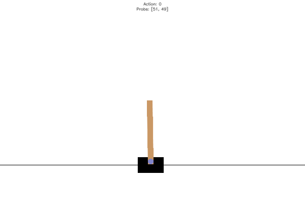
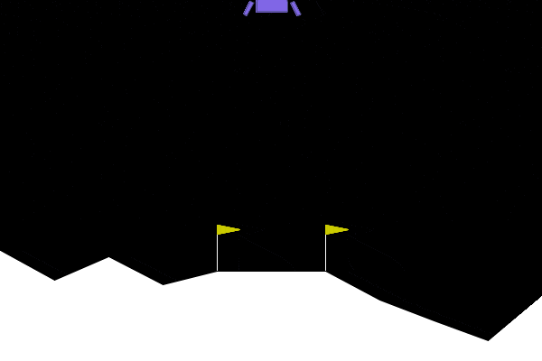
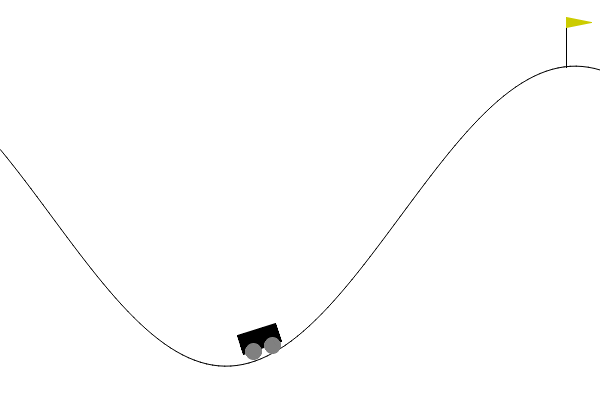
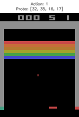
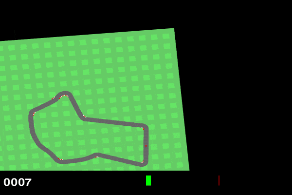
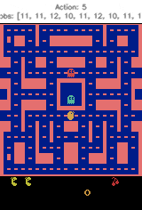
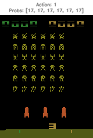

# RLAlgorithms
RLAlgorithms is a library offering DQN, DDQN, Dueling DDQN, A2C, and PPO algorithms with environment wrappers, visualizations, and monitoring tools. 

Ideal for reinforcement learning research and development, it is designed for ease of use and extensibility.

This repo was made to support my SnakeAgent project - teaching an agent to reach a perfect score in the game of snake: https://github.com/roihezkiyahu/SnakeAgent

| Game | GIF |
|:---------------------:|:-----------------:|
| CartPole |  |
|:---------------------:|:-----------------:|
| LunarLander |  |
|:---------------------:|:-----------------:|
| MountainCar |  |
|:---------------------:|:-----------------:|
| Breakout |  |
|:---------------------:|:-----------------:|
| CarRacing |  |
|:---------------------:|:-----------------:|
| MsPacman |  |
|:---------------------:|:-----------------:|
| SpaceInvaders |  |